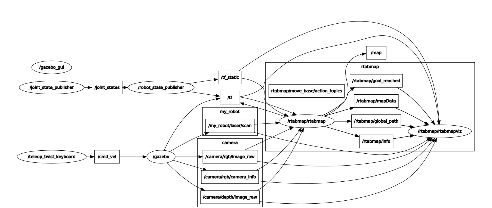

# RND_04_project

## RTab map file

Plese download the file from [Dropbox](https://www.dropbox.com/s/e6sz79kjbnt3551/rtabmap.db.tar.gz?dl=0) and unzip it.


### Overview

Map My World! In this project you will create a 2D occupancy grid and 3D octomap from a simulated environment using your own robot with the RTAB-Map package.

RTAB-Map (Real-Time Appearance-Based Mapping) is a popular solution for SLAM to develop robots that can map environments in 3D. RTAB-Map has good speed and memory management, and it provides custom developed tools for information analysis. Most importantly, the quality of the documentation on ROS Wiki (http://wiki.ros.org/rtabmap_ros) is very high. Being able to leverage RTAB-Map with your own robots will lead to a solid foundation for mapping and localization well beyond this Nanodegree program.

For this project we will be using the rtabmap_ros package, which is a ROS wrapper (API) for interacting with RTAB-Map. Keep this in mind when looking at the relative documentation.
Project Instructions

Udacity provides you with a in-classroom Workspace with ROS configured to work on the project. If you need a refresher, check out the Workspace tutorials.

### The project flow will be as follows:

    You will develop your own package to interface with the rtabmap_ros package.

    You will build upon your localization project to make the necessary changes to interface the robot 
    with RTAB-Map. An example of this is the addition of an RGB-D camera.

    You will ensure that all files are in the appropriate places, all links are properly connected, 
    naming is properly setup and topics are correctly mapped. Furthermore you will need to generate 
    the appropriate launch files to launch the robot and map its surrounding environment.

    When your robot is launched you will teleop around the room to generate a proper map of the environment.

We are excited to see you grow with your ROS skills and we can't wait to see what your map looks like!

### ROS nodes and topics

<p align="center">
  
</p>


### How to run

Open terminal and run
```
cd ~
git clone https://github.com/kurbakov/RND_04_project
mkdir -p catkin_ws/src 
cd catkin_ws/src
catkin_init_workspace
cp -r ../../RND_04_project/my_robot ./
cp -r ../../RND_04_project/teleop_twist_keyboard ./
cd ../
catkin_make
source devel/setup.bash
roslaunch my_robot world.launch
```

In new terminal window
```
rosrun teleop_twist_keyboard teleop_twist_keyboard.py
```

In new terminal window
```
roslaunch my_robot mapping.launch
```
